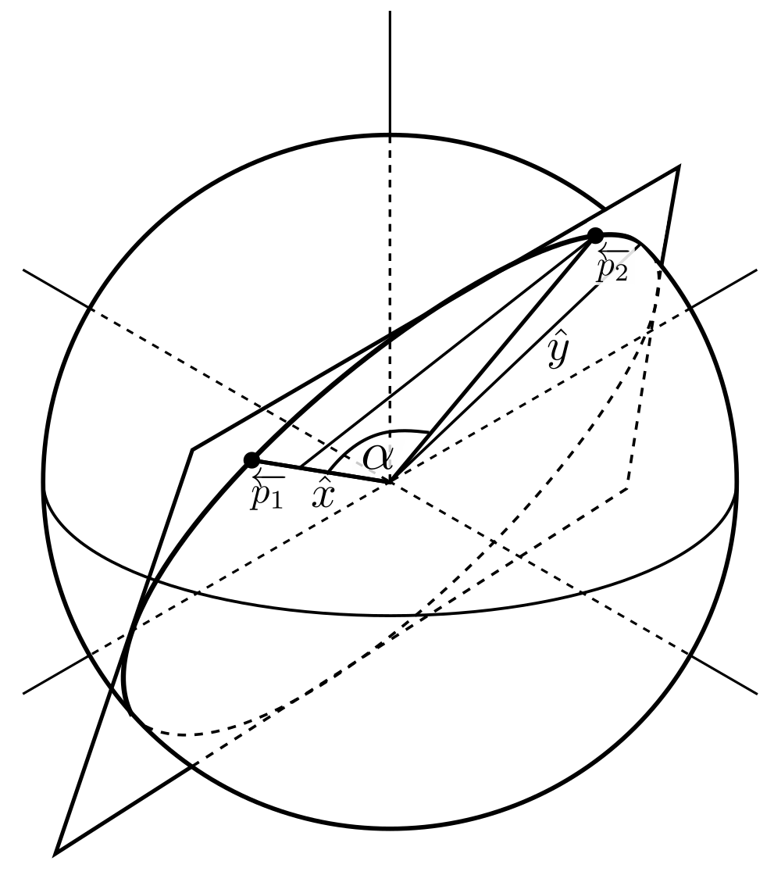

# Navigation plots

Plot rhumb lines (lines of constant bearing) and great circle arcs (lines of shortest distance) between two points on the earth. This uses [Cartopy](https://scitools.org.uk/cartopy/docs/latest/gallery/index.html).
The image of earth is based on [Natural Earth II](https://www.naturalearthdata.com/downloads/10m-raster-data/10m-natural-earth-2/).
A low resolution image is also included in this repository from [https://map-projections.net/single-view/rectang-0](https://map-projections.net/single-view/rectang-0).

### New York to Cape Town:

     
    

### Amsterdam to Hong Kong:

     
    

# Rhumb lines

Rhumb lines are straight lines on a Mercator map. The exterme points can be found using the Mercator projection equation:

Other points can be found on the straight line:

</a>

Solving for &phi; gives the latitudes for Plate Carree co-ordinates:

# Great circles
 

It's easiest to convert the spherical co-ordinates to Cartesian co-ordinates. 
A co-ordinate system is defined on the plane with the unit vectors (x&#770;,y&#770;).
x&#770; is defined as:

Using Euclidean geomtry, y&#770; is found with:

Where &alpha; is found using the dot product:

A general point on the circle is given by:

</a>

